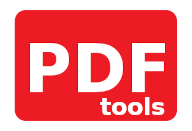

An easy solution for performing basic tasks with PDF files that are often locked behind 
a paywall in popular software.

This program is a simple wrapper for some of the functionality offered by the `pypdf`
library, packaged in a Tkinter GUI. It's intended audience is an everyday office
employee, even those that are not technically-inclined, looking for a quick and easy 
way to perform some actions not offered in the free version of the most popular PDF 
viewer/editor.

-----

*to-do:*
- *add pictures of program at runtime to readme*
- *add individual features and capabilities*
- *make readme a pretty landing page, as it is the 1st thing people see*